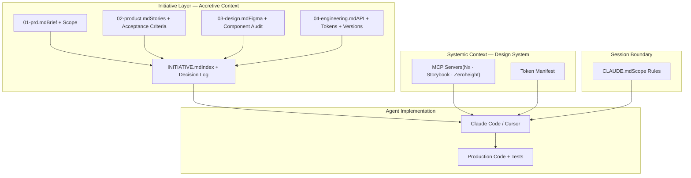

# Accretive Context Architecture

## A framework for lossless handoff & implementation using a machine-readable design system

## TL;DR

- Every product initiative generates a small set of lightweight documents, one each from product, design, and engineering, that accumulate context across the pipeline rather than discard it at each handoff
- The accumulated context is made executable by a fully machine-readable design system: components, tokens, and usage rules delivered directly to the agent via MCP servers, leaving nothing open to interpretation
- Implementation with full organisational context, producing solutions that accelerate engineering, near-eliminate design QA, and reflect genuine product intent

---

## Purpose

This layer enables an LLM to autonomously deliver a complete, scope-accurate implementation using the design system, without losing context across the handoff pipeline from initiative definition through to production code.

## The Problem It Solves

Every current handoff is a lossy compression. A product initiative starts with rich context: business rationale, user research, constraints, edge cases etc. In the current way of working, by the time tasks reach an engineer it has been refined to sets of granular tickets as measurable units of work, stripped of any nuance of business context. What we are finding through experimentation is that Claude delivers far more valuable results when provided with the maximum context, particularly even the business strategy layer at the point of execution. Rather than optimising for focused delivery with a reductive approach we can now consider the opposite: at the point if implementation the maximum context is made readily available, where each contributor has passed on their deliverables plus decisions and trade-offs made. The context and orchestration layer makes handoff lossless following the newly proposed accretive process.

---

## Layer Architecture

### 1. Initiative File Structure

Each initiative lives in its own folder in the repository, containing a fixed set of markdown files — one per pipeline stage. Each function owns their file independently. No file is ever overwritten. The prompt composition engine uses the index as its entry point and loads all files to assemble the full context package.

```
/initiative-name
  INITIATIVE.md     ← index, decision log, open questions
  01-prd.md         ← product: brief, scope, user stories
  02-product.md     ← product: acceptance criteria, analytics
  03-design.md      ← design: Figma refs, component audit, specs
  04-engineering.md ← engineering: API, tokens, versions
```

**INITIATIVE.md — the index**

The lightweight entry point for the LLM. It contains a one-line summary of the initiative, links to each file in the folder, a decision log recording every significant decision made during the initiative with rationale, and an open questions register listing unresolved decisions the LLM must flag rather than assume. This file is the only one that all functions touch — product, design, and engineering each append to the decision log at their handoff point.

**01-prd.md — product requirements**

Owned by product. Contains the business rationale, the problem being solved, the definition of success, user context, scope definition (explicitly in and out of scope), platform targets, and links to supporting research and analytics.

**02-product.md — product handoff**

Owned by product. Contains user stories with acceptance criteria written to a standard the LLM can execute against, analytics instrumentation requirements, and edge cases and failure states identified during discovery.

**03-design.md — design handoff**

Owned by design. Contains only what is specific to this initiative and does not exist in Zeroheight or Storybook. Systemic documentation — responsive behaviour, accessibility, motion, component usage guidelines — is covered by those tools and should not be duplicated here.

- Figma file link for the initiative designs
- Component manifest — which design system components are used in this initiative, so the LLM knows where to focus its Storybook and Zeroheight queries
- Deviations from the design system — anywhere the design intentionally goes off-piste, with rationale, so the LLM does not attempt to correct it back to the standard pattern
- Initiative-specific interaction behaviour that is particular to this feature and not covered by general component documentation
- Edge cases and empty states specific to this feature's data and context
- Design decisions and trade-offs made during the design process — why a particular pattern was chosen over an alternative

**04-engineering.md — engineering handoff**

Owned by engineering. Contains API contracts, state management approach, performance budgets, test requirements, and the specific package versions and token identifiers to be consumed. This is the file that locks the design system contract for the LLM — no component or token not listed here should be used.

By the time the LLM receives all five files, it holds the complete institutional memory of the initiative. No context has been lost at any handoff boundary, and no function has been blocked waiting for another to finish editing a shared document.

---

### 2. Design System as Machine-Readable Context

The design system exposes itself as LLM-consumable context through three MCP servers (Nx, Storybook, Zeroheight) and a generated token manifest. The full technical detail of each — what they expose, how they're configured, and how they relate to the component and documentation layers — is covered in [architecture.md § MCP Servers](architecture.md#5-mcp-servers).

The key point for this document is the role they play in the accretive model: the initiative files carry **initiative-specific** context (scope, decisions, trade-offs), while the MCP servers carry **systemic** context (component APIs, usage rules, token values, package graph). Neither is sufficient alone. The agent needs both to produce a complete implementation without hallucinating missing context or violating design system conventions.

---

### 3. CLAUDE.md — Scope Rules and Session Orientation

A `CLAUDE.md` file lives in the repository root and is read automatically by Claude Code at the start of every session. It contains two things:

**Repo orientation** — a brief description of the repository structure, where the initiative files live, which MCP servers are available and what each is for, and how the agent should navigate the workspace before beginning implementation.

**Scope preservation rules** — the constraints the LLM must operate within for every session:

- Never use a component not listed in the initiative's `03-design.md` component manifest
- Never hardcode a value that exists as a token — always reference the token by name
- Never make an architectural decision not covered by `04-engineering.md` without surfacing it as an open question
- Never assume the answer to an open question — flag it and halt
- Always confirm a component's lifecycle status via Nx MCP before using it — do not use experimental components in production implementations
- Always consume the exact package versions specified in `04-engineering.md`

With the initiative files in place and three MCP servers active, the agent has everything it needs. The `CLAUDE.md` simply ensures it operates within the right boundaries from the first token.

---

## Architecture Diagram

The full technical architecture — token pipeline, component libraries, documentation, and distribution — is documented in [architecture.md](architecture.md). The diagram below focuses on the accretive context flow: how initiative-specific context and systemic design system context converge at the point of agent implementation.



---

## What This Enables

The accretive model changes the economics of handoff. Instead of each function compressing their output into the next function's input format — losing nuance at every boundary — each function contributes a standalone document that preserves their full reasoning. The agent receives the union of all contributions, not a lossy summary.

This means the agent has access to *why* a scope boundary was drawn (product), *why* a particular pattern was chosen over an alternative (design), and *which* exact packages and versions to consume (engineering) — all in a single context load. Open questions are surfaced rather than assumed. Decisions are traceable to a specific function and rationale.

The design system architecture that makes this executable is documented in [architecture.md](architecture.md).
