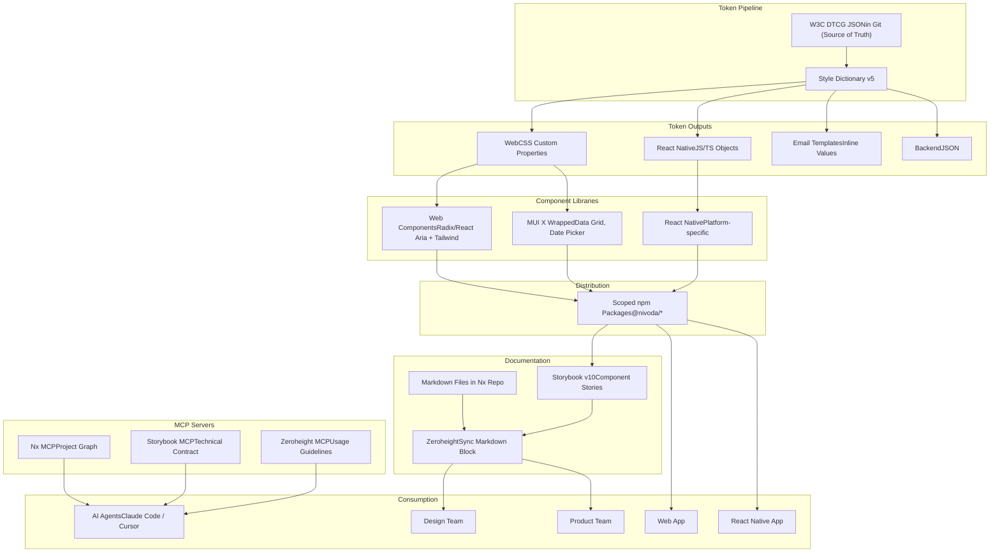

# Design System Architecture

## Subtitle: A unified, machine-readable design system spanning web and React Native, architected for AI-assisted implementation

---

## TL;DR

- A single monorepo built on Nx contains all design system packages — tokens, components, and documentation source files — for both web and React Native
- Design tokens are the unifying spine of the entire system, authored as W3C DTCG-compliant JSON directly in Git (code is the source of truth), and transformed by Style Dictionary v5 into platform-specific outputs for web, React Native, and backend. Figma is a scratchpad for exploration — not a token authoring tool
- Components are built on shadcn/ui (Radix UI primitives + Tailwind CSS) for web, and platform-specific implementations for React Native — sharing tokens and API conventions but not rendering code
- Evergreen documentation lives as markdown files inside the Nx repo and syncs to Zeroheight via its Sync Markdown block — a single source of truth that is both human-readable and machine-queryable via MCP
- Three MCP servers — Nx, Storybook, and Zeroheight — expose the entire system to AI coding agents, making the design system directly executable without manual context assembly

---

## Guiding Principles

- **Token-first** — every visual decision is a token. Nothing is hardcoded anywhere in the system
- **Headless by default** — components own behaviour and accessibility, not aesthetics. Styling is applied via Tailwind CSS utility classes, not a CSS-in-JS runtime
- **Platform-appropriate, not platform-identical** — web and React Native share tokens and component API conventions, but rendering implementations are separate and optimised for their platform
- **Documentation as code** — markdown files in the repo are the source of truth for all usage guidelines. Zeroheight is the publication layer, not the authoring layer
- **Machine-readable throughout** — every layer of the system is queryable by an AI agent via MCP servers, enabling autonomous implementation against a defined design system contract

---

## Architecture Overview

---

## Layer Detail

### 1. Token Pipeline

Design tokens are the single source of truth for all visual decisions across every surface. The pipeline is one-directional: tokens are authored in code and flow outward to platform-specific outputs. Figma is used for design exploration only — it is not part of the token pipeline.

**DTCG JSON in Git (Source of Truth)**
Tokens are authored directly as W3C Design Token Community Group (DTCG) format JSON files in the monorepo. The DTCG specification was ratified in October 2025 and is natively supported by Style Dictionary v5 and all major design tooling. The format uses `$value`, `$type`, and `$description` notation, enabling rich metadata alongside each token value. Engineers and design engineers edit these files directly via PRs.

Tokens Studio was evaluated and rejected — bidirectional Figma sync adds complexity for a problem the team doesn't have. Designers explore in Figma but do not author tokens there. There is no scenario where token definitions need to flow from Figma into code.

**Style Dictionary v5**
Style Dictionary transforms the DTCG JSON into platform-specific outputs:
- **Web** — CSS custom properties consumed by Tailwind CSS theme configuration
- **React Native** — JS/TS objects with unitless values (density-independent pixels)
- **Email templates** — inline CSS values for backend template injection
- **Backend** — plain JSON for any surface that needs token values without a framework dependency

Token coverage is universal. No surface in the product hardcodes a visual value.

---

### 2. Component Libraries

Components are split by platform. They share tokens and API conventions — naming, props, variants — but have separate rendering implementations optimised for their environment.

**Web — shadcn/ui + Tailwind CSS**
New components are built using shadcn/ui — a collection of pre-built components wired on top of Radix UI primitives and styled with Tailwind CSS, distributed as code owned directly in the repo rather than as a black-box dependency. This approach carries zero runtime CSS-in-JS overhead, works natively with Next.js App Router, and produces components with no aesthetic fingerprint to fight against.

shadcn/ui is chosen over building directly on Radix primitives because its documentation is the most comprehensive of any component system available, its community is the largest, and the volume of examples in AI training data means Claude Code and Cursor produce significantly more reliable output when working within the shadcn pattern.

The underlying primitive layer is Radix UI. The Radix team has shifted focus to Base UI (now under MUI, reached stable v1.1) — this is a long-term signal worth tracking. The shadcn maintainer is expected to migrate components from Radix to Base UI over time, meaning consuming teams absorb that transition without making the decision themselves. Base UI will be reassessed as a direct foundation in 12–18 months as its component coverage and community mature.

MUI X components (Data Grid, Date Picker) are retained for complex data interfaces where they remain best-in-class. They are wrapped behind the Nivoda component API so consumers are insulated from the underlying MUI dependency.

Existing MUI-based components are not migrated wholesale. They are wrapped behind the Nivoda API and migrated incrementally as they are touched.

**React Native — Platform-specific implementations**
React Native components share token values and prop naming conventions with their web counterparts but are implemented separately, using React Native's styling primitives. NativeWind is the preferred styling layer, providing a Tailwind-compatible API that bridges naturally with the web component system.

No attempt is made to unify web and React Native into a single component codebase. The industry evidence is clear that this produces lowest-common-denominator UX on both platforms.

**Component lifecycle**
All components follow a defined lifecycle enforced at the package level:
- **Experimental** — unpublished, available internally only via the `aer-component` staging package
- **Alpha / Beta** — published but flagged, not for production use
- **Stable** — published, production-ready
- **Deprecated** — published with deprecation notice, removed after two version cycles with mandatory migration guide

---

### 3. Monorepo & Nx Architecture

All design system packages live in a single Nx monorepo. This is not just a convenience — it is an architectural requirement for AI-assisted implementation.

**Why a monorepo**
A monorepo gives the Nx MCP server a complete, unified project graph of every package, its dependencies, and its build outputs. An AI agent can query this graph to understand the full scope of the design system without navigating multiple repositories. Atomic cross-package changes, shared dependency versions, and coordinated releases are all significantly easier in a monorepo.

**Nx orchestration**
Nx handles all package management automation — initialising new packages, version bumping, change log generation, and publishing — via a single command. The `nx affected` command detects which packages are impacted by a token or component change and rebuilds only those, keeping CI fast as the system scales.

`@nx/enforce-module-boundaries` is enabled to prevent business logic from leaking into design system packages. Clear tags are defined for token packages, primitive components, composed components, and application code. Boundary violations are caught at lint time, not at code review.

**Package distribution**
All stable components are published as private scoped npm packages under the `@nivoda` namespace. Core packages — tokens, primitive components, icons — use fixed versioning to eliminate cross-package compatibility ambiguity. Standalone utility packages version independently.

---

### 4. Documentation

Documentation is authored as markdown files inside the Nx monorepo and published to Zeroheight via its Sync Markdown block. The repo is the source of truth. Zeroheight is the publication and consumption layer.

**Markdown files in the Nx repo**
Every component and token set has a corresponding markdown file covering usage guidelines, when to use and when not to use, design rationale, accessibility requirements, content guidelines, and do/don't examples. These files live alongside the component code they document, versioned together, and updated as part of the same PR workflow.

This approach means documentation is never out of sync with the component it describes — a change to a component requires a corresponding update to its markdown file in the same commit.

**Zeroheight — Sync Markdown**
Zeroheight's Sync Markdown block pulls markdown files directly from the repo and renders them within the Zeroheight documentation hub. Designers and product managers access living documentation without touching the codebase. Engineers author documentation without leaving their normal workflow.

Storybook stories are embedded within Zeroheight pages to provide interactive component demos alongside the usage guidelines, giving non-technical stakeholders a complete picture without requiring them to navigate Storybook directly.

**Audience split**
- **Storybook** — engineering audience. Component APIs, interactive stories, prop tables, visual regression testing via Chromatic
- **Zeroheight** — cross-functional audience. Usage guidelines, Figma design references, component status, design principles, and research context

---

### 5. MCP Servers

Three MCP servers expose the design system to AI coding agents, collectively providing complete context for autonomous implementation.

**Nx MCP**
Exposes the live project graph of the monorepo. The agent can query which packages exist, their lifecycle status, their dependencies, and their build outputs without manually navigating the codebase.

**Storybook MCP**
Exposes the technical contract of every component — props, variants, composition patterns, interactive states, and stories. This is the engineering truth of the design system.

**Zeroheight MCP**
Exposes the usage guidelines layer — when to use a component, when not to, design rationale, accessibility guidance, content guidelines, and do/don't examples. This is the design and product truth of the design system. It is distinct from and complementary to Storybook: technical correctness without usage correctness produces implementations that are on-spec but wrong.

All three MCP servers must be active and configured in Claude Code and Cursor for the system to function as intended. Together they replace any need for manually assembled context or static component index files.

---

## What This Enables

With this architecture in place, an AI coding agent given an initiative brief has access to:

- The full token set for every platform, queryable by name
- Every stable component's technical API via Storybook MCP
- Every component's usage guidelines and design rationale via Zeroheight MCP
- The complete package graph and lifecycle status of every component via Nx MCP

It can implement a complete, design-system-compliant feature without hardcoding a single value, without using a deprecated or experimental component in production, and without making a styling decision that contradicts the documented design rationale.

This is what makes the design system a delivery infrastructure, not just a component library.