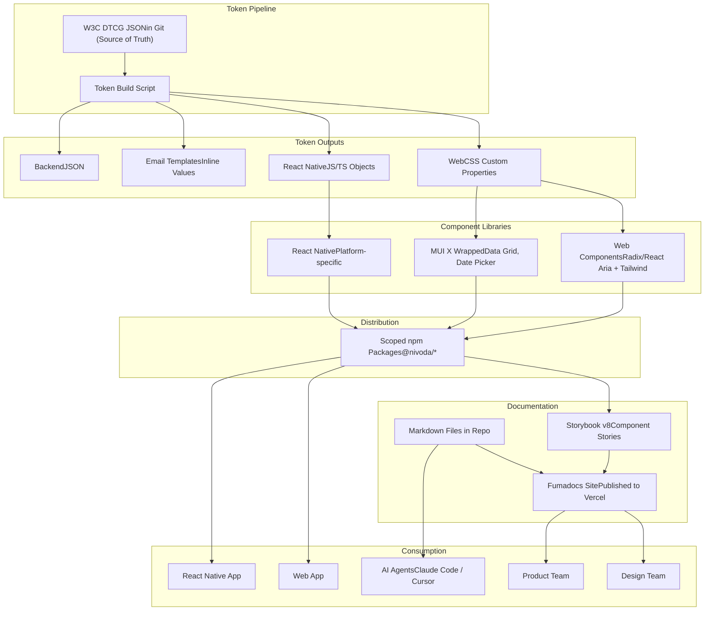

# Design System Architecture

## Subtitle: A unified, machine-readable design system spanning web and React Native, architected for AI-assisted implementation

---

## TL;DR

- A single monorepo built on Nx contains all design system packages — tokens, components, and documentation source files — for both web and React Native
- Design tokens are the unifying spine of the entire system, authored as W3C DTCG-compliant JSON (OKLCH color space) directly in Git (code is the source of truth), and transformed by a bespoke build script into platform-specific outputs for web, React Native, and backend. Figma is a scratchpad for exploration — not a token authoring tool
- Components are built on shadcn/ui (Radix UI primitives + Tailwind CSS) for web, and platform-specific implementations for React Native — sharing tokens and API conventions but not rendering code
- Evergreen documentation lives as markdown files inside the Nx repo, published via a Fumadocs static site — a single source of truth that is both human-readable and directly consumable by AI agents
- Documentation covers both the experience framework (governance, strategy, research) and the design system (components, tokens, patterns) in one browsable site

---

## Guiding Principles

- **Token-first** — every visual decision is a token. Nothing is hardcoded anywhere in the system
- **Headless by default** — components own behaviour and accessibility, not aesthetics. Styling is applied via Tailwind CSS utility classes, not a CSS-in-JS runtime
- **Platform-appropriate, not platform-identical** — web and React Native share tokens and component API conventions, but rendering implementations are separate and optimised for their platform
- **Documentation as code** — markdown files in the repo are the source of truth for all usage guidelines. Fumadocs publishes them as a branded site — authoring and publication from the same source
- **Machine-readable throughout** — every layer of the system is directly consumable by AI agents from the repo, enabling autonomous implementation against a defined design system contract

---

## Architecture Overview

---

## Layer Detail

### 1. Token Pipeline

Design tokens are the single source of truth for all visual decisions across every surface. The pipeline is one-directional: tokens are authored in code and flow outward to platform-specific outputs. Figma is used for design exploration only — it is not part of the token pipeline.

**DTCG JSON in Git (Source of Truth)**
Tokens are authored directly as W3C Design Token Community Group (DTCG) format JSON files in the monorepo. The DTCG specification was ratified in October 2025 and is supported by all major design tooling. The format uses `$value`, `$type`, and `$description` notation, enabling rich metadata alongside each token value. Color tokens use the OKLCH color space via DTCG structured color objects — this is the W3C DTCG v2025.10 standard, aligning with Tailwind v4 and shadcn/ui. Engineers and design engineers edit these files directly via PRs.

Tokens Studio was evaluated and rejected — bidirectional Figma sync adds complexity for a problem the team doesn't have. Designers explore in Figma but do not author tokens there. There is no scenario where token definitions need to flow from Figma into code.

**Bespoke Build Script (`build.mjs`)**
A ~200-line Node.js script transforms the DTCG JSON into platform-specific outputs:
- **Web** — CSS custom properties (OKLCH) consumed by Tailwind CSS theme configuration
- **shadcn** — flat-named CSS custom properties (`:root` + `.dark` scopes) for direct consumption by shadcn/ui-based frontends and the eventual platform migration
- **React Native** — JS/TS objects with hex values and unitless dimensions
- **Email templates** — inline CSS values (hex) for backend template injection
- **Backend** — plain JSON for any surface that needs token values without a framework dependency

The script handles DTCG reference resolution, OKLCH↔hex color conversion (via `culori`), and multi-format output. See [Architectural Decisions](#architectural-decisions) for why a bespoke script was chosen over Style Dictionary.

Token coverage is universal. No surface in the product hardcodes a visual value.

---

### 2. Component Libraries

Components are split by platform. They share tokens and API conventions — naming, props, variants — but have separate rendering implementations optimised for their environment.

**Web — shadcn/ui + Tailwind CSS**
New components are built using shadcn/ui — a collection of pre-built components wired on top of Radix UI primitives and styled with Tailwind CSS, distributed as code owned directly in the repo rather than as a black-box dependency. This approach carries zero runtime CSS-in-JS overhead, works natively with Next.js App Router, and produces components with no aesthetic fingerprint to fight against.

shadcn/ui is chosen over building directly on Radix primitives because its documentation is the most comprehensive of any component system available, its community is the largest, and the volume of examples in AI training data means Claude Code and Cursor produce significantly more reliable output when working within the shadcn pattern.

The underlying primitive layer is Radix UI. The Radix team has shifted focus to Base UI (now under MUI, reached stable v1.1) — this is a long-term signal worth tracking. The shadcn maintainer is expected to migrate components from Radix to Base UI over time, meaning consuming teams absorb that transition without making the decision themselves. Base UI will be reassessed as a direct foundation in 12–18 months as its component coverage and community mature.

MUI X components (Data Grid, Date Picker) are retained for complex data interfaces where they remain best-in-class. They are wrapped behind the Nivoda component API so consumers are insulated from the underlying MUI dependency.

Existing MUI-based components are not migrated wholesale. They are wrapped behind the Nivoda API and migrated incrementally as they are touched.

**React Native — Platform-specific implementations**
React Native components share token values and prop naming conventions with their web counterparts but are implemented separately, using React Native's styling primitives. NativeWind is under evaluation as a Tailwind-compatible styling bridge, but the React Native implementation approach is not yet finalised.

No attempt is made to unify web and React Native into a single component codebase. The industry evidence is clear that this produces lowest-common-denominator UX on both platforms.

**Component lifecycle**
All components follow a defined lifecycle enforced at the package level:
- **Experimental** — unpublished, available internally only via the `aer-component` staging package
- **Alpha / Beta** — published but flagged, not for production use
- **Stable** — published, production-ready
- **Deprecated** — published with deprecation notice, removed after two version cycles with mandatory migration guide

---

### 3. Monorepo & Nx Architecture

All design system packages live in a single Nx monorepo. This is not just a convenience — it is an architectural requirement for AI-assisted implementation.

**Why a monorepo**
A monorepo gives the Nx MCP server a complete, unified project graph of every package, its dependencies, and its build outputs. An AI agent can query this graph to understand the full scope of the design system without navigating multiple repositories. Atomic cross-package changes, shared dependency versions, and coordinated releases are all significantly easier in a monorepo.

**Nx orchestration**
Nx handles all package management automation — initialising new packages, version bumping, change log generation, and publishing — via a single command. The `nx affected` command detects which packages are impacted by a token or component change and rebuilds only those, keeping CI fast as the system scales.

`@nx/enforce-module-boundaries` is enabled to prevent business logic from leaking into design system packages. Clear tags are defined for token packages, primitive components, composed components, and application code. Boundary violations are caught at lint time, not at code review.

**Package distribution**
All stable components are published as private scoped npm packages under the `@nivoda` namespace. Core packages — tokens, primitive components, icons — use fixed versioning to eliminate cross-package compatibility ambiguity. Standalone utility packages version independently.

---

### 4. Documentation

Documentation is authored as markdown files in the repos and published via a Fumadocs-powered static site deployed to Vercel. The repos are the source of truth. The site is the publication layer — built directly from the source at build time, never a copy.

**Markdown files in the repos**
Every component and token set has a corresponding markdown file covering usage guidelines, when to use and when not to use, design rationale, accessibility requirements, content guidelines, and do/don't examples. These files live alongside the component code they document, versioned together, and updated as part of the same PR workflow.

This approach means documentation is never out of sync with the component it describes — a change to a component requires a corresponding update to its markdown file in the same commit.

**Fumadocs site**
A single Fumadocs site serves as the browsable front door for both the experience framework (governance, strategy, personas, surface rules) and the design system (components, tokens, patterns). It provides full-text search, responsive layout, dark mode, and MDX support for interactive content. Storybook stories can be embedded via iframes when the component library matures.

The site deploys to Vercel on push. No external vendor, no sync to maintain, no cost beyond hosting.

**Audience split**
- **Fumadocs site** — cross-functional audience. Governance, strategy, usage guidelines, component documentation, design principles. The internal face of how Nivoda designs and builds products.
- **Storybook** — engineering audience. Component APIs, interactive stories, prop tables. Visual regression testing deferred until component library reaches 10+ components (see [Architectural Decisions](#architectural-decisions)).
- **Repo markdown** — AI agents. Claude Code and Cursor read documentation directly from the repo. No MCP server needed — the source files are the interface.

---

### 5. AI Agent Consumption

AI coding agents (Claude Code, Cursor) consume the design system directly from the repo — no MCP servers required for documentation access. The markdown files in the experience framework and clarity-v2 repos are the interface.

Agents have access to:
- **Token definitions** — DTCG JSON files, queryable by name and category
- **Component contracts** — source code, TypeScript interfaces, Storybook stories
- **Usage guidelines** — markdown files co-located with components
- **Governance rules** — experience framework agent instructions
- **Project graph** — Nx workspace structure and package dependencies

This direct-from-source approach means agents always read the current state, never a stale copy. No sync, no intermediate layer, no MCP configuration required.

---

## Architectural Decisions

This section records significant technology decisions with their rationale, so future contributors understand not just what we chose but why.

### ADR-001: Bespoke build script over Style Dictionary (April 2026)

**Context:** Style Dictionary v5 was the original architectural choice for the token pipeline. It is the industry-standard token transformation engine, created by Amazon and co-maintained by Tokens Studio. The initial scaffolding used SD's config-driven approach with `transformGroup`, platform definitions, and the `css/variables` format.

As the architecture evolved to support shadcn/ui-compatible output for Minivoda (the consumer frontend), the SD integration required increasingly custom code:

- A custom name transform to strip prefixes and produce flat names (`--background`, not `--shadcn-background`)
- A custom format to output `:root {}` and `.dark {}` scoped CSS
- Three separate SD instances per build (main platforms + light theme + dark theme)
- Working around `outputReferences` behaviour (shadcn output must resolve references because primitive tokens aren't in the output file)
- A programmatic `build.mjs` wrapper instead of SD's config file

**Decision:** Replace Style Dictionary with a ~200-line Node.js build script (`build.mjs`) that reads DTCG JSON, resolves references, and outputs all platform formats directly. One optional dependency: `culori` (~3KB) for OKLCH↔hex color conversion.

**Rationale:**

| Factor | Style Dictionary | Bespoke script |
|---|---|---|
| Lines of custom code needed | ~80 (transforms, formats, 3 SD instances, concat) | ~200 (entire pipeline) |
| Dependencies | SD + ~30 transitive deps (colorjs.io, chalk, prettier) | culori only |
| Theming | 3 SD instances + file concatenation | An `if` statement |
| Readability | Requires understanding SD's plugin API | Plain Node.js, top to bottom |
| Maintainer profile | Design lead (Chris), not a build-tooling engineer | Simpler to maintain |
| DTCG source format | Unchanged | Unchanged |
| Output format | Unchanged | Unchanged |

**Trade-offs accepted:**
- Lose SD's community-maintained DTCG spec alignment — we track spec changes ourselves
- Lose recognisable tooling name in the stack — future engineers learn our script instead of SD's API
- Reference resolution is hand-rolled (~30 lines) — needs testing for edge cases (circular refs, missing refs)

**Reversibility:** High. The DTCG source files are identical regardless of build tool. Migrating back to SD requires writing an SD config that reads the same source files — no token changes needed.

**When to reconsider:** If token count exceeds ~500, multiple teams author tokens, or a complex transform chain is needed (e.g., Android XML, iOS Swift asset catalogs).

---

### ADR-002: Chromatic removed (April 2026)

**Context:** Chromatic was installed as a devDependency in `packages/components` with a project token in the `chromatic` npm script. It was planned as the visual regression testing layer, running against Storybook stories to catch unintended visual changes in PRs.

**Decision:** Remove Chromatic entirely. If visual regression testing is needed in the future, evaluate self-hosted alternatives first.

**Rationale:**

1. **Security incident.** In December 2025, a Storybook vulnerability (affecting v7.0+) was disclosed where `.env` file contents could be bundled into Storybook's JavaScript output. Chromatic runs `storybook build` as part of its publishing process, meaning secrets in `.env` files could be exposed in published Storybooks. Nivoda's platform team responded by migrating Storybook hosting off Chromatic to a self-hosted staging environment behind VPN (`storybook-coreui.dev.nivodaapi.net`), managed via Jenkins + GitOps. Engineering's recommendation is to move away from Chromatic.
2. **One component.** The library contains a single Button component. Visual regression testing for one component is pure overhead.
3. **No CI/CD pipeline.** Chromatic's value is PR-level visual diffs. Without CI integration, it's a manual step nobody will run.
4. **Cost at scale.** Chromatic bills per snapshot beyond the free tier. Paying for snapshots of components not yet in production is waste.
5. **Project token exposed.** A Chromatic project token was hardcoded in `package.json` and is in git history. The token value has been redacted from this doc; it must be rotated at Chromatic regardless of whether the service is ever re-used.
6. **Platform team precedent.** The main platform's Storybook is already self-hosted behind VPN. Clarity-v2 should follow the same pattern when ready, not introduce a third-party dependency the org has moved away from.

**If visual regression testing is needed later:**
- Evaluate self-hosted options (e.g., Playwright visual comparisons, Lost Pixel) that align with the platform team's Jenkins + GitOps approach
- Only after 10+ components with active CI/CD
- Any tokens or secrets must be CI secrets, never in source

---

### ADR-003: Tokens Studio rejected (original decision, retained)

**Context:** Tokens Studio provides bidirectional Figma↔code token sync. Evaluated during initial architecture design.

**Decision:** Rejected. Designers explore in Figma but do not author tokens there. Bidirectional sync adds complexity for a problem the team doesn't have.

---

### ADR-004: Fumadocs over Zeroheight (April 2026)

**Context:** Zeroheight was planned as the cross-functional documentation platform — a polished hub where designers, PMs, and engineers could browse component guidelines, Figma embeds, and Storybook demos without touching the codebase. A Zeroheight MCP server was planned as one of three MCP servers exposing the design system to AI agents.

**Decision:** Replace Zeroheight with a Fumadocs-powered static documentation site deployed to Vercel. Remove Zeroheight MCP from the architecture.

**Rationale:**

1. **The source is already agent-readable.** Documentation is authored as markdown in the repo. AI agents read these files directly. A Zeroheight MCP server would query a copy of content the agent already has — adding a dependency with zero information gain.

2. **No sync to maintain.** Zeroheight's Sync Markdown block pulls from the repo, but it's a one-way copy that can drift. Fumadocs reads markdown at build time from the repo itself — the site *is* the source, not a reflection of it.

3. **Covers both repos.** A single Fumadocs site can serve as the front door for both the experience framework (governance, strategy, research) and clarity-v2 (components, tokens, patterns). Zeroheight would have been limited to design system documentation.

4. **Zero cost, full control.** Fumadocs is open source, deploys to Vercel (already used for Minivoda), and gives full control over branding, structure, and navigation. Zeroheight is ~$16-49/editor/month with vendor constraints.

5. **Stakeholder evangelisation.** The experience framework needs an internal-facing URL that leadership and product teams can browse. A branded Fumadocs site (`experience.nivoda.com` or similar) serves this need directly.

6. **Extensible.** MDX support means interactive component demos can be embedded when the component library matures. Storybook stories can be iframed into documentation pages.

**What Fumadocs provides:**
- Full-text search across all documentation
- Responsive, fast, branded site from markdown source
- Next.js App Router foundation (same stack as Minivoda)
- Dark mode, syntax highlighting, table of contents, breadcrumbs
- MDX for interactive content when needed

---

## What This Enables

With this architecture in place, an AI coding agent given an initiative brief has access to:

- The full token set for every platform, queryable by name
- Every stable component's technical API via Storybook (when populated)
- Every component's usage guidelines and design rationale via markdown files in the repo
- The complete package graph and lifecycle status of every component via Nx

It can implement a complete, design-system-compliant feature without hardcoding a single value, without using a deprecated or experimental component in production, and without making a styling decision that contradicts the documented design rationale.

For human stakeholders, the Fumadocs site provides the same content as a polished, browsable experience — the internal face of how Nivoda designs and builds products.

This is what makes the design system a delivery infrastructure, not just a component library.